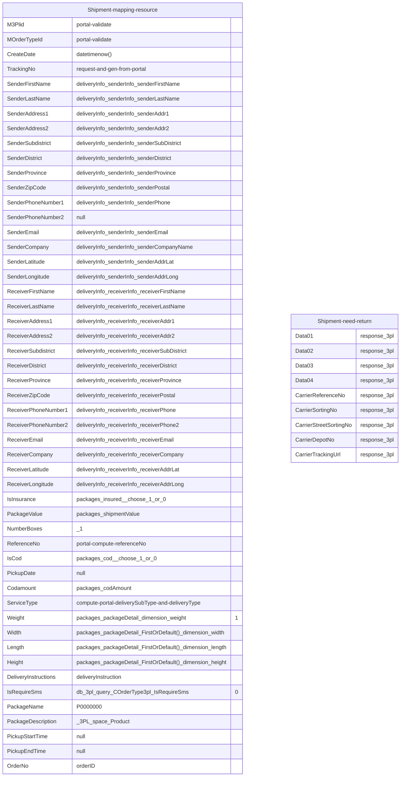

```mermaid
erDiagram
    Shipment-mapping-resource {
        M3Plid portal-validate
        MOrderTypeId portal-validate
        CreateDate datetimenow()
        TrackingNo request-and-gen-from-portal
        SenderFirstName deliveryInfo_senderInfo_senderFirstName
        SenderLastName deliveryInfo_senderInfo_senderLastName
        SenderAddress1 deliveryInfo_senderInfo_senderAddr1
        SenderAddress2 deliveryInfo_senderInfo_senderAddr2
        SenderSubdistrict deliveryInfo_senderInfo_senderSubDistrict
        SenderDistrict deliveryInfo_senderInfo_senderDistrict
        SenderProvince deliveryInfo_senderInfo_senderProvince
        SenderZipCode deliveryInfo_senderInfo_senderPostal
        SenderPhoneNumber1 deliveryInfo_senderInfo_senderPhone
        SenderPhoneNumber2 null
        SenderEmail deliveryInfo_senderInfo_senderEmail
        SenderCompany deliveryInfo_senderInfo_senderCompanyName
        SenderLatitude deliveryInfo_senderInfo_senderAddrLat
        SenderLongitude deliveryInfo_senderInfo_senderAddrLong
        ReceiverFirstName deliveryInfo_receiverInfo_receiverFirstName
        ReceiverLastName deliveryInfo_receiverInfo_receiverLastName
        ReceiverAddress1 deliveryInfo_receiverInfo_receiverAddr1
        ReceiverAddress2 deliveryInfo_receiverInfo_receiverAddr2
        ReceiverSubdistrict deliveryInfo_receiverInfo_receiverSubDistrict
        ReceiverDistrict deliveryInfo_receiverInfo_receiverDistrict
        ReceiverProvince deliveryInfo_receiverInfo_receiverProvince
        ReceiverZipCode deliveryInfo_receiverInfo_receiverPostal
        ReceiverPhoneNumber1 deliveryInfo_receiverInfo_receiverPhone
        ReceiverPhoneNumber2 deliveryInfo_receiverInfo_receiverPhone2
        ReceiverEmail deliveryInfo_receiverInfo_receiverEmail
        ReceiverCompany deliveryInfo_receiverInfo_receiverCompany
        ReceiverLatitude deliveryInfo_receiverInfo_receiverAddrLat
        ReceiverLongitude deliveryInfo_receiverInfo_receiverAddrLong
        IsInsurance packages_insured__choose_1_or_0
        PackageValue packages_shipmentValue
        NumberBoxes _1
        ReferenceNo portal-compute-referenceNo
        IsCod packages_cod__choose_1_or_0
        PickupDate null
        Codamount packages_codAmount
        ServiceType compute-portal-deliverySubType-and-deliveryType
        Weight packages_packageDetail_dimension_weight "1"
        Width packages_packageDetail_FirstOrDefault()_dimension_width
        Length packages_packageDetail_FirstOrDefault()_dimension_length
        Height packages_packageDetail_FirstOrDefault()_dimension_height
        DeliveryInstructions deliveryInstruction
        IsRequireSms db_3pl_query_COrderType3pl_IsRequireSms "0"
        PackageName P0000000
        PackageDescription _3PL_space_Product
        PickupStartTime null
        PickupEndTime null
        OrderNo orderID
    }
    Shipment-need-return {
        Data01 response_3pl
        Data02 response_3pl
        Data03 response_3pl
        Data04 response_3pl
        CarrierReferenceNo response_3pl
        CarrierSortingNo response_3pl
        CarrierStreetSortingNo response_3pl
        CarrierDepotNo response_3pl
        CarrierTrackingUrl response_3pl
    }
```