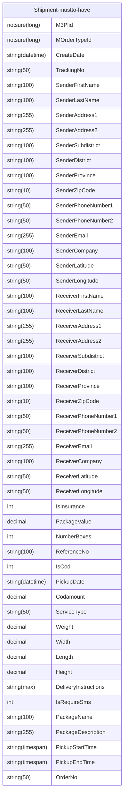

```mermaid
erDiagram
    Shipment-mustto-have {
        notsure(long) M3Plid
        notsure(long) MOrderTypeId
        string(datetime) CreateDate
        string(50) TrackingNo
        string(100) SenderFirstName
        string(100) SenderLastName
        string(255) SenderAddress1
        string(255) SenderAddress2
        string(100) SenderSubdistrict
        string(100) SenderDistrict
        string(100) SenderProvince
        string(10) SenderZipCode
        string(50) SenderPhoneNumber1
        string(50) SenderPhoneNumber2
        string(255) SenderEmail
        string(100) SenderCompany
        string(50) SenderLatitude
        string(50) SenderLongitude
        string(100) ReceiverFirstName
        string(100) ReceiverLastName
        string(255) ReceiverAddress1
        string(255) ReceiverAddress2
        string(100) ReceiverSubdistrict
        string(100) ReceiverDistrict
        string(100) ReceiverProvince
        string(10) ReceiverZipCode
        string(50) ReceiverPhoneNumber1
        string(50) ReceiverPhoneNumber2
        string(255) ReceiverEmail
        string(100) ReceiverCompany
        string(50) ReceiverLatitude
        string(50) ReceiverLongitude
        int IsInsurance
        decimal PackageValue
        int NumberBoxes
        string(100) ReferenceNo
        int IsCod
        string(datetime) PickupDate
        decimal Codamount
        string(50) ServiceType
        decimal Weight
        decimal Width
        decimal Length
        decimal Height
        string(max) DeliveryInstructions
        int IsRequireSms
        string(100) PackageName
        string(255) PackageDescription
        string(timespan) PickupStartTime
        string(timespan) PickupEndTime
        string(50) OrderNo
    }
```