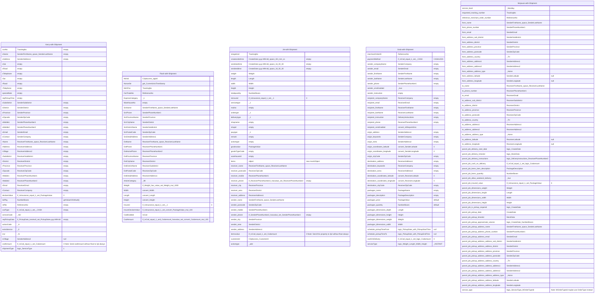

```mermaid
erDiagram
    Kerry-with-Shipment {
        conNo TrackingNo "empty"
        sName SenderFirstName_space_SenderLastName "empty"
        sAddress SenderAddress1 "empty"
        sSoi empty
        sRoad empty
        sTelephone empty
        rSoi empty
        rRoad empty
        rTelephone empty
        specialNote empty
        reqPickupTime empty
        sSubdistrict SenderSubdistrict "empty"
        sDistrict SenderDistrict "empty"
        sProvince SenderProvince "empty"
        sZipcode SenderZipCode "empty"
        sMobile1 SenderPhoneNumber1 "empty"
        sMobile2 SenderPhoneNumber2 "empty"
        sEmail SenderEmail "empty"
        sContact SenderCompany "empty"
        rName ReceiverFirstName_space_ReceiverLastName "empty"
        rAddress ReceiverAddress1 "empty"
        rVillage ReceiverAddress2 "empty"
        rSubdistrict ReceiverSubdistrict "empty"
        rDistrict ReceiverDistrict "empty"
        rProvince ReceiverProvince "empty"
        rZipcode ReceiverZipCode "empty"
        rMobile1 ReceiverPhoneNumber1 "empty"
        rMobile2 ReceiverPhoneNumber2 "empty"
        rEmail ReceiverEmail "empty"
        rContact ReceiverCompany "empty"
        declareValue if_IsInsurance_equal_1_set_PackageValue "0"
        totPkg NumberBoxes "getValueOrDefault()"
        refNo ReferenceNo "empty"
        codType if_IsCod_equal_1_set__CASH "empty"
        serviceCode _ND
        reqPickupDate if_PickupDate_isnotnull_set_PickupDate-yyyy-MM-dd "empty"
        actionCode _A
        extraService _0
        invr _N
        sVillage SenderAddress2 "null"
        codAmount if_IsCod_equal_1_set_Codamount "0 Note: Send codAmount without float to 3pl always"
        shipmentType logic_ServiceType "1"
    }
    Flash-with-Shipment {
        MchId C3placcess_appId
        NonceStr get_CurrentUnixTimeStamp
        MchPno TrackingNo
        OutTradeNo ReferenceNo
        ExpressCategory _1
        WarehouseNo empty
        SrcName SenderFirstName_space_SenderLastName
        SrcPhone SenderPhoneNumber1
        SrcProvinceName SenderProvince
        SrcCityName SenderDistrict
        SrcDistrictName SenderSubdistrict
        SrcPostalCode SenderZipCode
        SrcDetailAddress SenderAddress1
        DstName ReceiverFirstName_space_ReceiverLastName
        DstPhone ReceiverPhoneNumber1
        DstHomePhone ReceiverPhoneNumber2
        DstProvinceName ReceiverProvince
        DstCityName ReceiverDistrict
        DstDistrictName ReceiverSubdistrict
        DstPostalCode ReceiverZipCode
        DstDetailAddress ReceiverAddress1
        ArticleCategory _99
        Weight if_Weight_has_value_set_Weight_mul_1000
        Width convert_Width
        Length convert_Length
        Height convert_Height
        Insured if_IsInsurance_equal_1_set__1 "0"
        InsureDeclareValue if_IsInsurance_equal_1_set_convert_PackageValue_mul_100
        CodEnabled IsCod
        CodAmount if_IsCod_equal_1_and_Codamount_hasvalue_set_convert_Codamount_mul_100
    }
    Jnt-with-Shipment {
        txlogisticid TrackingNo
        createordertime CreateDate-yyyy-MM-dd_space_HH_mm_ss "empty"
        sendstarttime CreateDate-yyyy-MM-dd_space_16_00_00 "empty"
        sendendtime CreateDate-yyyy-MM-dd_space_18_00_00 "empty"
        weight Weight
        length Length
        width Width
        height Height
        totalquantity NumberBoxes
        isinsured if_IsInsurance_equal_1_set__1 "0"
        servicetype _1
        mailno empty
        ordertype _1
        deliverytype _1
        shopname empty
        shopid empty
        paytype _1
        remark empty
        actiontype empty
        goodsvalue PackageValue
        goodsTypeCode empty
        warehouseId empty
        items object "new mockObject"
        receiver_name ReceiverFirstName_space_ReceiverLastName
        receiver_postcode ReceiverZipCode
        receiver_mobile ReceiverPhoneNumber1
        receiver_phone if_ReceiverPhoneNumber2_hasvalue_set_ReceiverPhoneNumber2 "empty"
        receiver_city ReceiverProvince
        receiver_area ReceiverDistrict
        receiver_address ReceiverAddress1
        sender_name SenderFirstName_space_SenderLastName
        sender_postcode SenderZipCode
        sender_mobile SenderPhoneNumber1
        sender_phone if_SenderPhoneNumber2_hasvalue_set_SenderPhoneNumber2 "empty"
        sender_city SenderProvince
        sender_area SenderDistrict
        sender_address SenderAddress1
        itemsvalue if_IsCod_equal_1_set_Codamount "0 Note: Send this property to 3pl without float always"
        customerid C3placcess_CustomerId
        actiontype _add
    }
    Grab-with-Shipment {
        merchantOrderID ReferenceNo
        paymentMethod if_IsCod_equal_1_set__CASH "CASHLESS"
        sender_companyName SenderCompany "empty"
        sender_email SenderEmail "empty"
        sender_firstName SenderFirstName "empty"
        sender_lastName SenderLastName "empty"
        sender_phone SenderPhoneNumber1 "empty"
        sender_smsEnabled _true
        sender_instruction empty
        recipient_companyName ReceiverCompany "empty"
        recipient_email ReceiverEmail "empty"
        recipient_firstName ReceiverFirstName "empty"
        recipient_lastName ReceiverLastName "empty"
        recipient_instruction DeliveryInstructions "empty"
        recipient_phone ReceiverPhoneNumber1 "empty"
        recipient_smsEnabled convert_IsRequireSms
        origin_address SenderAddress1 "empty"
        origin_keywords SenderCompany "empty"
        origin_extra SenderAddress2 "empty"
        origin_coordinates_latitude convert_SenderLatitude "0"
        origin_coordinates_longitude convert_SenderLongitude "0"
        origin_cityCode SenderZipCode "empty"
        destination_address ReceiverAddress1 "empty"
        destination_keywords ReceiverCompany "empty"
        destination_extra ReceiverAddress2 "empty"
        destination_coordinates_latitude convert_ReceiverLatitude "0"
        destination_coordinates_longitude convert_ReceiverLongitude "0"
        destination_cityCode ReceiverZipCode "empty"
        packages_name PackageName "empty"
        packages_description PackageDescription "empty"
        packages_price PackageValue "default"
        packages_quantity NumberBoxes "default"
        packages_dimensions_depth Length 
        packages_dimensions_height Height
        packages_dimensions_weight Weight
        packages_dimensions_width Width
        schedule_pickupTimeFrom logic_PickupDate_with_PickupStartTime "null"
        schedule_pickupTimeTo logic_PickupDate_with_PickupEndTime "null"
        cashOnDelivery if_IsCod_equal_1_set_logic_Codamount "0"
        serviceType logic_Weight_Length_Width_Height "_INSTANT"
    }
    Ninjavan-with-Shipment {
        service_level _Nextday
        requested_tracking_number TrackingNo
        reference_merchant_order_number ReferenceNo
        from_name SenderFirstName_space_SenderLastName
        from_phone_number SenderPhoneNumber1
        from_email SenderEmail
        from_address_sub_district SenderSubdistrict
        from_address_district SenderDistrict
        from_address_province SenderProvince
        from_address_postcode SenderZipCode
        from_address_country _TH
        from_address_address1 SenderAddress1
        from_address_address2 SenderAddress2
        from_address_address_type _Home
        from_address_latitude SenderLatitude "null"
        from_address_longitude SenderLongitude "null"
        to_name ReceiverFirstName_space_ReceiverLastName
        to_phone_number ReceiverPhoneNumber1
        to_email ReceiverEmail
        to_address_sub_district ReceiverSubdistrict
        to_address_district ReceiverDistrict
        to_address_province ReceiverProvince
        to_address_postcode ReceiverZipCode
        to_address_country _TH
        to_address_address1 ReceiverAddress1
        to_address_address2 ReceiverAddress2
        to_address_address_type _Home
        to_address_latitude ReceiverLatitude "null"
        to_address_longitude ReceiverLongitude "null"
        parcel_job_delivery_start_date logic_CreateDate
        parcel_job_delivery_timeslot logic_MockData
        parcel_job_delivery_instructions logic_DeliveryInstructions_ReceiverPhoneNumber2
        parcel_job_cash_on_delivery if_IsCod_equal_1_set_logic_Codamount
        parcel_job_items_item_description PackageDescription
        parcel_job_items_quantity NumberBoxes
        parcel_job_allow_weekend_delivery _true
        parcel_job_insured_value if_IsInsurance_equal_1_set_PackageValue "0"
        parcel_job_dimensions_weight Weight
        parcel_job_dimensions_lenght Length
        parcel_job_dimensions_width Width
        parcel_job_dimensions_height Height
        parcel_job_is_pickup_required logic_CreateDate
        parcel_job_pickup_date CreateDate
        parcel_job_pickup_timeslot MockData
        parcel_job_pickup_approximate_volume logic_CreateDate_NumberBoxes
        parcel_job_pickup_address_name SenderFirstName_space_SenderLastName
        parcel_job_pickup_address_phone_number SenderPhoneNumber1
        parcel_job_pickup_address_email SenderEmail
        parcel_job_pickup_address_address_sub_district SenderSubdistrict
        parcel_job_pickup_address_address_district SenderDistrict
        parcel_job_pickup_address_address_province SenderProvince
        parcel_job_pickup_address_address_postcode SenderZipCode
        parcel_job_pickup_address_address_country _TH
        parcel_job_pickup_address_address_address1 SenderAddress1
        parcel_job_pickup_address_address_address2 SenderAddress2
        parcel_job_pickup_address_address_address_type _Home
        parcel_job_pickup_address_address_latitude SenderLatitude
        parcel_job_pickup_address_address_longitude SenderLongitude
        service_type logic_ServiceType_MOrderTypeId "Note: MOrderTypeId maybe use OrderType instead"
    }
```